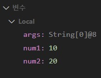

### 메서드 영역

- 코드, 스태틱 변수, 메서드, 런타임 상수 pool이 생성되는 영역
- 프로그램 시작 전에 로드되고, 프로그램 종료 시 소멸

### 스택 영역

- 메서드 호출 시 지역변수, 매개변수가 프레임 형태로 생성되어 스택영역으로 쌓였다가 사라짐
- 프레임 기준으로, 다른 프레임의 변수를 참조할 수 없음

### 힙 영역

- 클래스의 객체, 배열이 new 연산자에 의해 동적으로 생성되는 영역
- 사용없음이 확인될 경우 자동 제거

### static 디버깅 실습

1. main 메서드 실행, 사용될 매개변수와 지역변수를 처리할 프레임이 스택영역에 생성
2. 매개변수 args가 프레임 안에 생성
3. num1 변수가 int형으로 만들어지고 10 대입받음
4. num2 변수가 int형으로 만들어지고 20 대입받음

\*\* 현재 프레임의 스택 내용만 보여줌으로 보이지 않을 수 있음 \*\*

5. adder 메서드가 실행되면서 이에 대한 프레임이 스택영역에 생성
6. 매개변수 n1, n2가 스택영역에 생성
7. result까지 메서드의 진행이 끝나면

8. System.out.println이 실행되고
9. main이 끝나면 프레임이 스택영역에서 제거됨
10. 아무것도 없으면 프로그램 종료

- JVM은 무조건 main 메서드를 먼저 실행시키기 때문에 반드시 있어야 하고, public 접근이 가능해야 함
- 그리고 이 영역의 변수 및 메서드는 어떤 객체에서도 접근 가능하므로 전역 변수라고도 함
